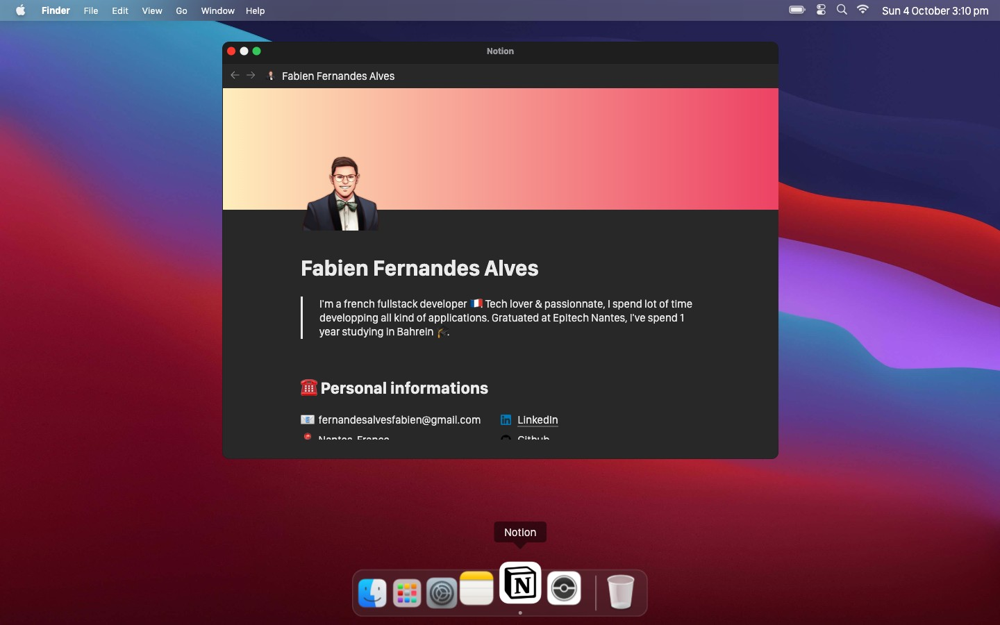
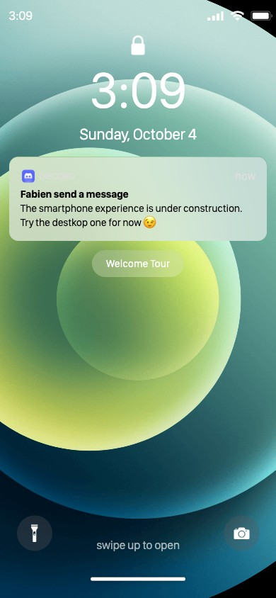
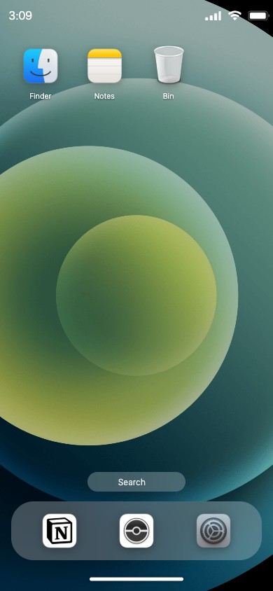

[](https://app.netlify.com/sites/gracious-kilby-08419b/deploys)

# Mac Portfolio

A portfolio that looks like an operating system. Instead of scrolling a page, you open apps.

- **Live**: [fabien.fernandesalves.fr](https://fabien.fernandesalves.fr/)
- **Preprod**: [fernan-x.github.io/mac-portfolio](https://fernan-x.github.io/mac-portfolio/)



## The concept

A recruiter has seen a thousand portfolio pages. This one is a macOS Big Sur desktop running in the browser: a menu bar, a dock, draggable windows, a dark mode and a wallpaper picker. Each part of the portfolio is an "app":

| App | What it shows |
| --- | --- |
| **Notion** | The actual résumé: bio, languages, work experience, education, skills |
| **Pokedex** | A small side project using the [PokéAPI](https://pokeapi.co/), with infinite scroll and detail pages |
| **Settings** | Light / dark theme, wallpaper, language (English / French) |
| **Launchpad** | App grid, as on macOS |
| **Finder, Notes, Bin** | Placeholders, still under construction |

The site adapts to the device:

- **Desktop** (wider than 768px): a macOS desktop with windows you can move, resize, maximize and stack.
- **Mobile** (768px or less): an iPhone with a lock screen, a home screen, a dock and a status bar.

A first-time **welcome tour** explains the idea. It can be replayed from the Help menu on desktop or from the lock screen on mobile.

### Mobile

<p>
  
  &nbsp;&nbsp;
  
</p>

## Tech stack

- [React 19](https://react.dev/) and TypeScript, built with [Vite](https://vite.dev/)
- [Zustand](https://zustand.docs.pmnd.rs/) for state (open apps, theme, onboarding, launchpad, pokedex)
- [Framer Motion](https://www.framer.com/motion/) and Lottie for animations
- [react-rnd](https://github.com/bokuweb/react-rnd) for draggable and resizable windows
- [i18next](https://www.i18next.com/) for English and French
- SCSS for styling
- [Vitest](https://vitest.dev/) and Testing Library for tests

## Getting started

```bash
pnpm install    # or yarn
pnpm start      # http://localhost:5173
```

Open the page below 768px wide (or use the browser's device mode) to see the iPhone version.

## Scripts

| Command | Description |
| --- | --- |
| `pnpm start` | Dev server |
| `pnpm build` | Production build in `dist/` |
| `pnpm serve` | Preview the production build |
| `pnpm test` | Run the tests (watch mode) |
| `pnpm lint` | ESLint |
| `pnpm typecheck` | TypeScript check |

## Project structure

```
src/
├── applications/   # One folder per app (Notion, Pokedex, Settings, About...)
├── components/     # Desktop (menu bar, dock, launchpad), Smartphone, Onboarding
├── layouts/        # Window chrome shared by desktop apps
├── constants/      # App registry (constants.tsx) and images
├── store/          # Zustand stores
├── locales/        # en_US and fr_FR translations
└── DesktopApp.tsx / SmartphoneApp.tsx
```

To add an app, create it in `src/applications/` and register it in `src/constants/constants.tsx`.

## Deployment

- **Production**: Netlify
- **Preprod**: GitHub Pages, deployed by `.github/workflows/deploy-preprod.yml`
